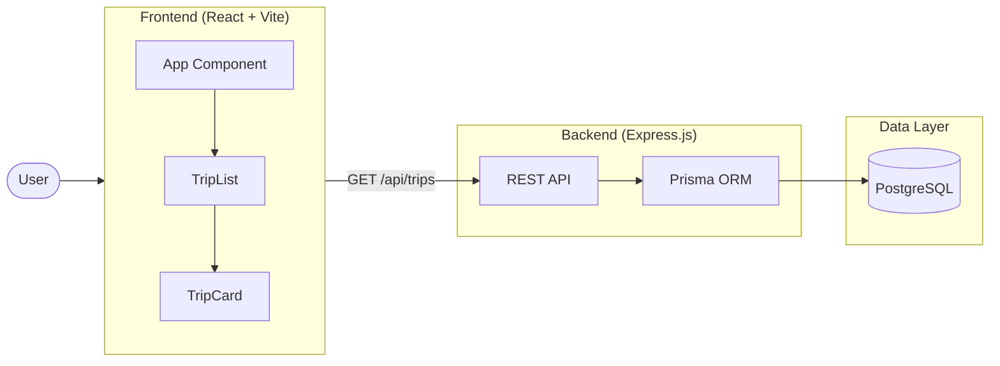
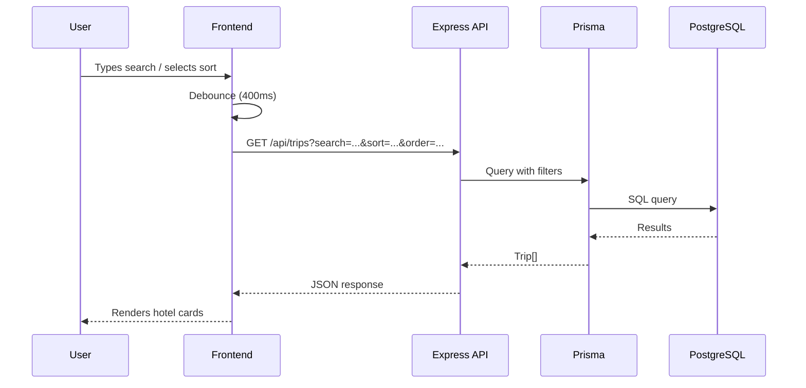

# Travel Search App

A fullstack travel search application with real-time filtering and sorting, built with React, Express, and PostgreSQL. Built as a learning project to practice building a complete web application with a REST API, database integration, and responsive UI.

## Screenshot


## Architecture



## Request Flow



## Tech Stack

| Layer | Technology |
|-------|-----------|
| Frontend | React 19, TypeScript, Vite |
| Styling | Tailwind CSS |
| Backend | Express.js 5, TypeScript |
| ORM | Prisma 7 |
| Database | PostgreSQL 16 |
| Shared | TypeScript interfaces across frontend and backend |

## Features

- **Real-time search** with server-side filtering via query parameters
- **Sorting** by price, rating, and name (ascending/descending)
- **Debounced input** (400ms) to reduce unnecessary API calls
- **Responsive grid layout** (1/2/3 columns based on screen size)
- **Shared types** across frontend and backend via a common `types/` directory
- **Database seeding** with sample trip data via Prisma

## API

| Method | Endpoint | Parameters | Description |
|--------|----------|------------|-------------|
| GET | `/api/trips` | `?search=<string>` | Filter trips by name |
| | | `?sort=price\|rating\|name` | Sort by field |
| | | `?order=asc\|desc` | Sort direction |

**Examples:**
```
GET /api/trips?search=resort
GET /api/trips?sort=price&order=desc
GET /api/trips?search=beach&sort=rating&order=desc
```

## Getting Started

### Prerequisites

- Node.js 20+
- PostgreSQL 16

### Setup

1. Clone the repository
   ```bash
   git clone https://github.com/AdamBess/travel-search-app.git
   cd travel-search-app
   ```

2. Create the database
   ```bash
   psql -U postgres
   CREATE DATABASE reisesuche;
   \q
   ```

3. Start the backend
   ```bash
   cd backend
   npm install
   npx prisma generate
   npx prisma migrate dev
   npx tsx prisma/seed.ts
   npm run dev
   # Server running on http://localhost:3000
   ```

4. Start the frontend
   ```bash
   cd frontend
   npm install
   npm run dev
   # App running on http://localhost:5173
   ```

## What I Learned

- Building a REST API with Express 5 and TypeScript
- Database modeling and migrations with Prisma ORM
- Server-side filtering and sorting with query parameters
- Debouncing user input to optimize API calls
- Responsive layouts with Tailwind CSS
- Sharing TypeScript types across frontend and backend in a monorepo